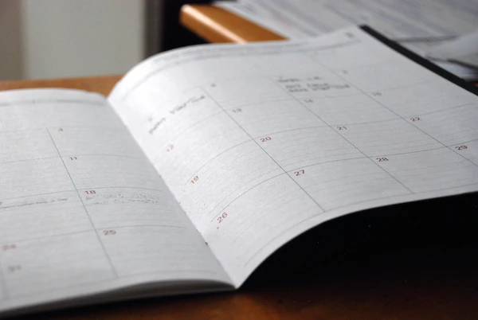
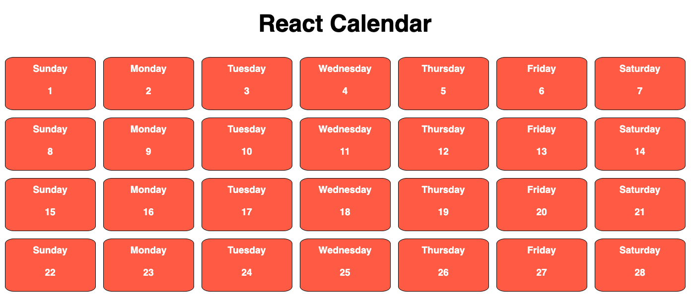
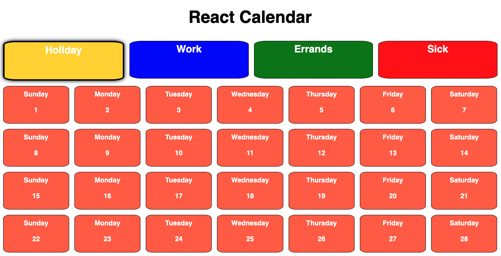
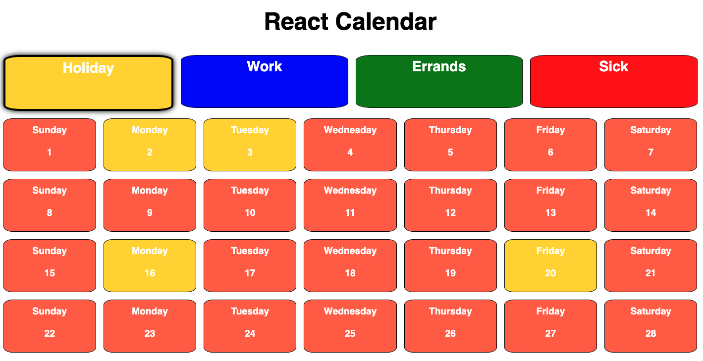
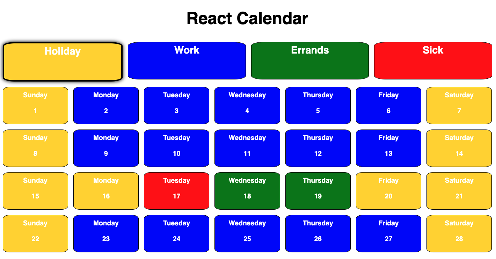

# React Calendar - Part 1

## Intro

You goal for this lab will be to use the skills you have learned in React to recreate the React Calendar seen below:

## Setup

You will need to create a React-based CodeSandbox to complete the lab

## Wireframes

We’re going to go with a clean, minimalistic user interface.

    Note: Feel free to go with your own layout, colors, etc.

Follow the instructions below to complete your own React Calendar!

## Instructions

Copy the following code to your App.js to use as a starting point.
DO NOT CHANGE THE days OR dates ARRAYS!

  import "./styles.css";

  export default function App() {

    const days = [
      {
        name: "Sunday"
      },
      {
        name: "Monday"
      },
      {
        name: "Tuesday"
      },
      {
        name: "Wednesday"
      },
      {
        name: "Thursday"
      },
      {
        name: "Friday"
      },
      {
        name: "Saturday"
      },
    ]

    // The following creates an array of numbers from [1..28]
    const dates = Array.from({length: 28}, (x, i) => i + 1)

    return (
      

        <h1>React Calendar</h1>
      

    );
  }

Using the provided dates and days arrays, create a <Calendar /> component that looks like the wireframe above.
You must pass the arrays down using props, and use that data to display the name & date for each day.
Your calendar should have 4 even rows (weeks) with 7 cells (days) in each row.
Inside each cell, you should display the name of the day on top & the date below.
Note: Don’t forget to keep checking the wireframe to make sure you are on the right track!

Code away and have fun!

This lab is not is a deliverable.

# React Calendar - Part 2

## Intro

We will be adding to Part 1 of the React Calendar lab by adding a few color applicators to help you organize the days of your calendar.

## Setup

Continue working in the same CodeSandbox that you used for Part 1!

## Instructions

We’re going to be adding the functionality to change the background color of each cell, in order to organize them by category.

    Note: Again, feel free to go with your own layout, colors, etc.

### Step 1

- You will need to add 4 (or more) color selectors above the calendar
- When the pages loads, your page should look like this:

### Step 2

- When you click on one of the categories at the top of the page (Holiday, Work, Errands, Sick), that category should be styled to show that it is “selected”
- You can see in the example below, the category “Holiday” has a glow/border to show that it is the selected category

    Note: How you choose to show a category is selected is up to you, even a simple border will work!

### Step 3

- After selecting a category at the top of the page, you should be able to click on any cell (day) in the calendar and apply the color of the category to the background color of the cell
- In our example, since we have selected “Holiday”, clicking on any cell in the calendar should change the background color of that cell to gold
- Selecting a new category should un-select the previously selected category, and highlight the newly selected category

### Step 4

- Add the same functionality to each category, so that you can add each color to your calendar and organize your schedule by category

Code away and have fun!

This lab is not is a deliverable.